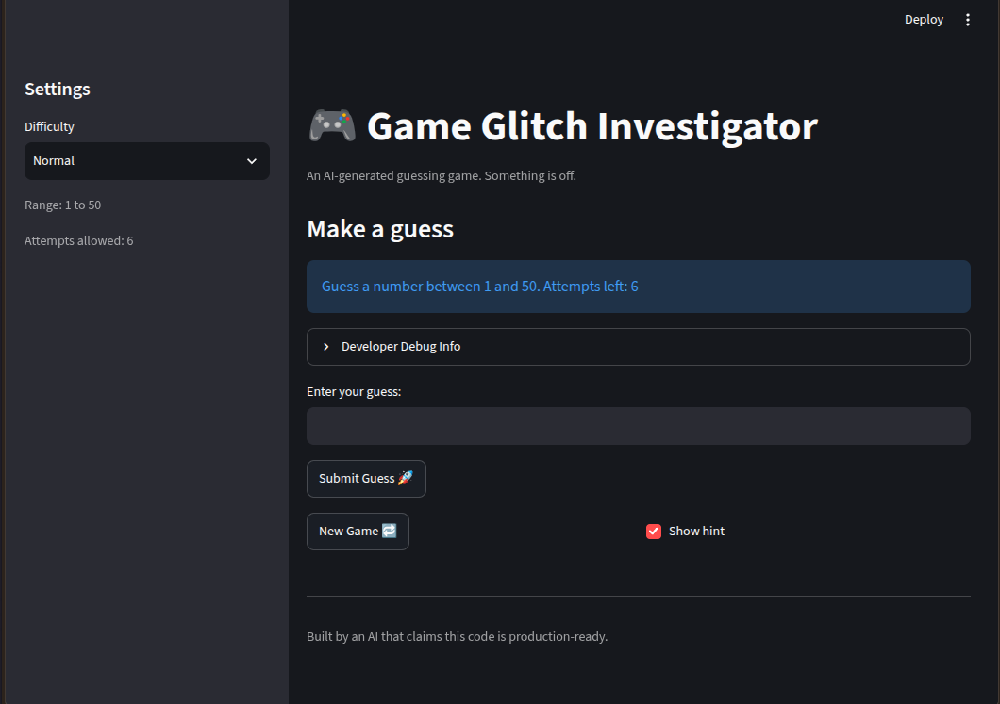

# 🎮 Game Glitch Investigator: The Impossible Guesser

## 🚨 The Situation

You asked an AI to build a simple "Number Guessing Game" using Streamlit.
It wrote the code, ran away, and now the game is unplayable. 

- You can't win.
- The hints lie to you.
- The secret number seems to have commitment issues.

## 🛠️ Setup

1. Install dependencies: `pip install -r requirements.txt`
2. Run the broken app: `python -m streamlit run app.py`

## 🕵️‍♂️ Your Mission

1. **Play the game.** Open the "Developer Debug Info" tab in the app to see the secret number. Try to win.
2. **Find the State Bug.** Why does the secret number change every time you click "Submit"? Ask ChatGPT: *"How do I keep a variable from resetting in Streamlit when I click a button?"*
3. **Fix the Logic.** The hints ("Higher/Lower") are wrong. Fix them.
4. **Refactor & Test.** - Move the logic into `logic_utils.py`.
   - Run `pytest` in your terminal.
   - Keep fixing until all tests pass!

## 📝 Document Your Experience

- [X] Describe the game's purpose.
  - This game is a demo of the streamlit framework, and is a simple number guessing game, where you can choose 1 of 3 levels, and try to guess a secret number within a limited number of guesses. 
- [X] Detail which bugs you found.
  - As I detailed in the reflection.md file, I found at least 4 bugs.  
      1. The hints were in the reverse directions
      2. The numeric guesses were not getting compared correctly with the secret.
      3. The state was not getting properly reset after a finished game.
      4. The count of guesses left was not being correctly incremented. 
- [X] Explain what fixes you applied.
    - Using Claude code, I was able to move the logic of the applicaiton to the logic_utils.py file.  I was also able to create a number of tests for the application to verify that it all was working properly. 
  - 

## 📸 Demo Walkthrough

Describe your fixed game in numbered steps so a reader can follow along without watching a video:

1. Select the difficulty from the dropdown on the left hand side of the application.  There are three levels, easy, medium, and hard.  Easy has a secret value of 1 to 20, medium is 1 to 50, and hard is 1 to 100.  For each level you get a number of guesses.  Easy you get 8 guesses, medium is 6 guessses, and hard is 4 guesses.
2. After eelecting a level.  Enter a guess.
3. Adjust your guess based on the hint, higher or lower.  
4. If you want to play another game, select a different level and/or press the 'new game' button.
5. You can choose if you want hints displayed or not with the "Show Hint" checkbox. 

**Screenshot** :
<p align="left"></p>

## 🧪 Test Results

(.venv) 📦[peteshaw@ai110 ai110-module1show-gameglitchinvestigator-starter]$ .venv/bin/python -m pytest -v 2>&1 | tail -20
rootdir: /home/peteshaw/dev/ai110-module1show-gameglitchinvestigator-starter
plugins: anyio-4.15.1
collecting ... collected 14 items

tests/test_app_hints.py::test_too_high_guess_shows_go_lower PASSED       [  7%]
tests/test_app_hints.py::test_too_low_guess_shows_go_higher PASSED       [ 14%]
tests/test_app_hints.py::test_out_of_range_guess_shows_error PASSED      [ 21%]
tests/test_game_logic.py::test_difficulty_ranges PASSED                  [ 28%]
tests/test_game_logic.py::test_attempt_limits PASSED                     [ 35%]
tests/test_game_logic.py::test_winning_guess PASSED                      [ 42%]
tests/test_game_logic.py::test_guess_too_high PASSED                     [ 50%]
tests/test_game_logic.py::test_guess_too_low PASSED                      [ 57%]
tests/test_game_logic.py::test_numeric_strings_are_compared_by_integer_value PASSED [ 64%]
tests/test_game_logic.py::test_parse_guess PASSED                        [ 71%]
tests/test_game_logic.py::test_very_large_numbers PASSED                 [ 78%]
tests/test_game_logic.py::test_range_check PASSED                        [ 85%]
tests/test_game_logic.py::test_negative_numbers PASSED                   [ 92%]
tests/test_game_logic.py::test_decimal_numbers PASSED                    [100%]

============================== 14 passed in 1.27s ==============================
(.venv) 📦[peteshaw@ai110 ai110-module1show-gameglitchinvestigator-starter]$ ```

## 🚀 Stretch Features

- [ ] [If you choose to complete Challenge 4, describe the Enhanced UI changes here — a screenshot is optional]
