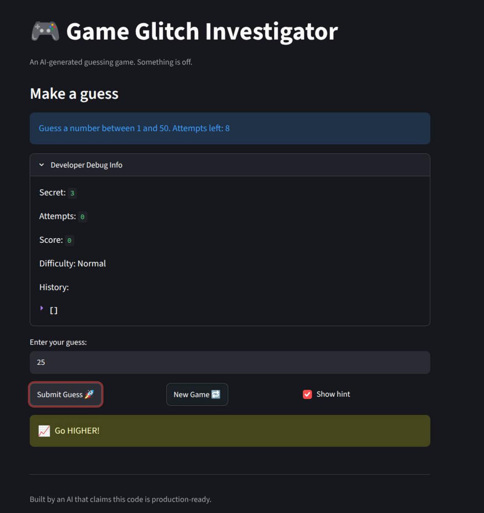
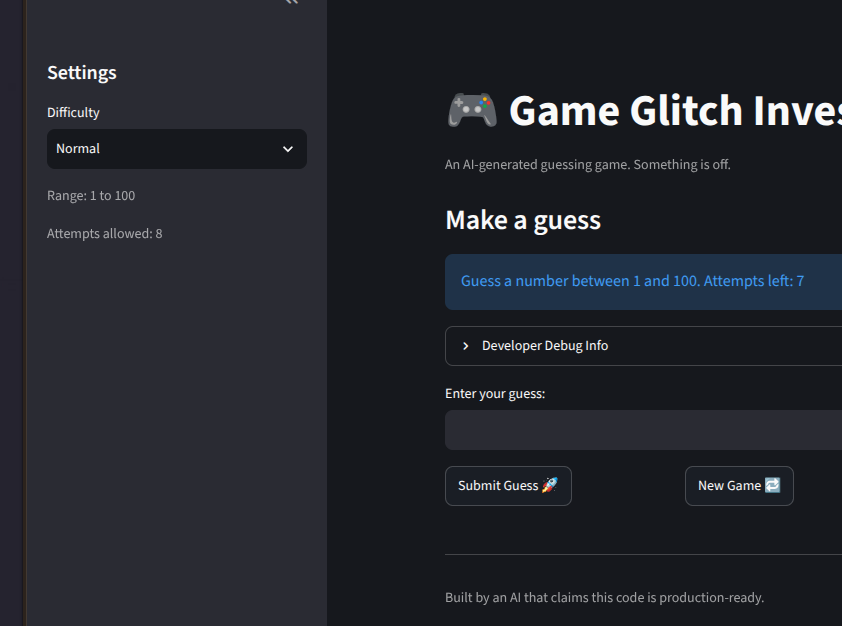
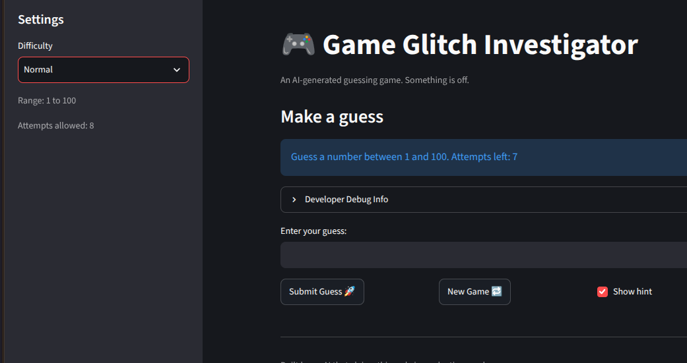

#### 1.1 - setting up the initial assignment
  - using distrobox w/debian sid which has python 3.13 as default
  - rest is standard.
#### 1.2 - setting up the initial assignment
  - running the app and looking for bugs
  - created .runner.sh, bettter approach is to set vs code to run so I cacn debug.   
  - claud advised that I use this as .vscode/launch.json

```
{
  "version": "0.2.0",
  "configurations": [
    {
      "name": "Streamlit",
      "type": "debugpy",
      "request": "launch",
      "module": "streamlit",
      "args": ["run", "${workspaceFolder}/app.py"],
      "justMyCode": true
    }
  ]
}
```
 - since this is working better than the runner.sh I will move that and the setup.sh
### 1.3 running and testing the asssignment.  Try to find three disctinct bugs. 
 - Specifically:
 - Bug Reproduction Evidence
     - There is a written trace or terminal output (in a markdown code block or committed text file) documenting that the game was run, referencing specific game events.
     - 	Two or more incorrect behaviors, each tied to a specific input/trigger and its observed (incorrect) output (e.g., a Bug Reproduction Logs table row), not merely named.
     - Each documented bug specifies expected vs actual behavior (e.g., "Score never increases when collecting items," "Game crashes on arrow-key input due to missing boundary check") 
     - an entry giving only the actual result does not count.
### 1.4 Bugs found and documented with a trace or terminal output.

 - terminal form first run
```
[peteshaw@ai110 ai110-module1show-gameglitchinvestigator-starter]$  /usr/bin/env /home/peteshaw/dev/ai110-module1show-gameglitchinvestigator-starter/.venv/bin/python /home/peteshaw/.vscode/extensions/ms-python.debugpy-2026.6.0-linux-x64/bundled/libs/debugpy/adapter/../../debugpy/launcher 34757 -- -m streamlit run /home/peteshaw/dev/ai110-module1show-gameglitchinvestigator-starter/app.py 
2026-10-06 15:50:24.584 Uvicorn server started on :::8501

  You can now view your Streamlit app in your browser.

  Local URL: http://localhost:8501
  Network URL: http://192.168.68.57:8501

  Help agents write better Streamlit apps?
```
 - Comment from Claud
 - *Streamlit gotchas that cause bugs*
     - The script reruns from the top on every interaction. Ordinary variables reset each time, so anything that needs to persist must go in st.session_state.
     - Initialize state only once, with if "key" not in st.session_state: st.session_state.key = .... If you assign it unconditionally, it resets on every rerun.
     - Widgets update one step late. A button's effect shows up on the next rerun. If the display lags behind by one click, use on_click= callbacks or st.rerun().
     - Caching hides changes. @st.cache_data can serve stale results. Clear it from the ☰ menu with "Clear cache", or press C.
     - For more detailed logs: streamlit run app.py --logger.level=debug.

### 1.5 Bugs found in program

1. entered 25 as a guess, the debug info showed 22
   - expected answer "Go Lower"
   - App said "Go Higher"
   - see screenshot below
  <p align="left"></p>

2. selected normal difficulty
    - expected to see range from 1-50
    - instead saw a range of 1-100
    - alsp the 'hard difficulty' resulted in a range of 1-50
<p align="left"></p>
  
3. Selected a normal difficulty
 -  Expected to see a consistent number of guesses.  
 -  The settings showed 8
 -  the blue bar showed 7
 -  additionally, the number of guesses should get smaller as difficulty increases, so easy = 8, normal = 6, easy = 4.
<p align="left"></p>

4. New Game Button not initializing all elements of game
 - Expected to see the "game over" message to disappear and a new game to start.
 - Instead, the game interface did not reset, and a game was unable to be played. This only occured intermittently.